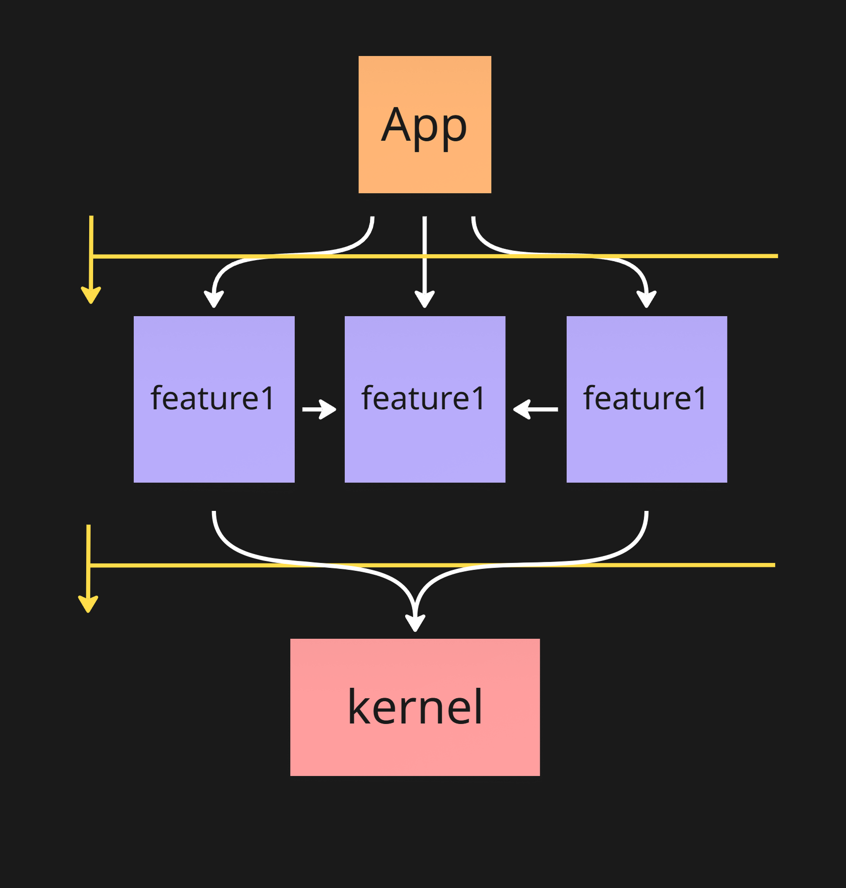
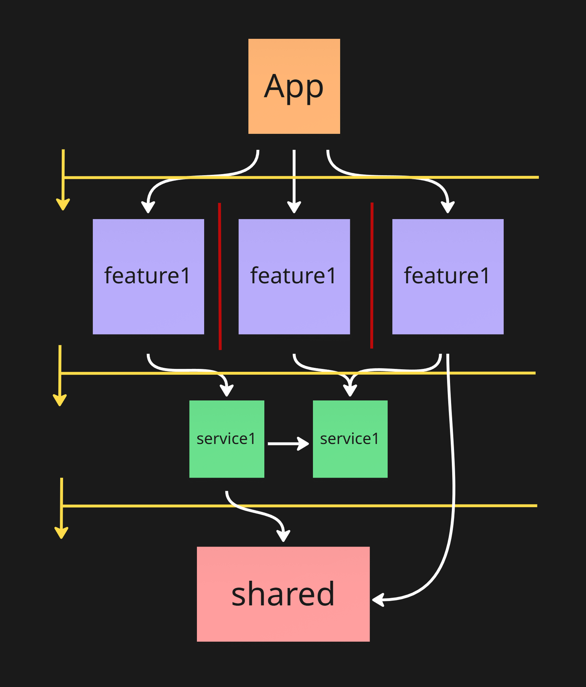

import { FileTree } from "@astrojs/starlight/components";
import { Aside } from "@astrojs/starlight/components";

Этот раздел для тех, кто хочет просто попробовать не вдаваясь в подробности.

## Какие проекты можно делать на ED

ED предназначен для работы на основных web фреймворках: vue, react, svelte, solid.

В простых модификациях он будет полезен даже в самых базовых проектах.

Единственное для разработки библиотек, ED не предназначен. Но вы всегда можете взять часть паттернов если они вам будут полезны.

## Модификации ED

Архитектура представлена в 4х модификациях

1. Для маленьких проектов (до 12 человеко/месяцев разработки)
2. Для средних проектов (комманда до 5-6 человек фронтов)
3. Для крупных проектов (больше одной комманды)
4. Для комманды которая работает над несколькими проектами

В текущем гайде будут описаны, первые 2 модификации. 3-4 в будущем будут описаны в других статьях

## Из чего состоит ED.

Для внешнего наблюдателя, это просто папочки и фийлики. На самом же деле это абстракции и архитектурные границы.

Подробнее об этом мы поговорим далее. Но пока вам никто не мишает об этом думать, как о папочках и файликах

Первое с чего начинаетс ED это с выделение слоёв.

## Выделение основных слоёв

Как и в большей части архитектур, в ED на верхнем уровне код организован по слоям.

Всего есть 4 слоя верхнего уровня.

<FileTree>

- src/
  - app/
  - features/
  - services/
  - kernel/

</FileTree>

<details>
    <summary>Отличия от FSD</summary>

- В ED `kernel` в отличии от `shared` может содержать бизнес логику.
- `services` очень похожи на `entities`, но тут нет ограничений на семантику "объекта из бизнеса"
- `features` это крупные куски функциональности приложения. По сути это слои `pages` `widgets` `features` `entities` в одном.
- Отдельного слоя `pages` нет. Код страниц находится в `features`. Если страницы содержат несколько фич, то композиция находится в `app`
- Слайсы у нас называются модулями, а сегменты группами. А ещё у нас разрешены под модули.

</details>

### App

---

Слой точка входа. Здесь происходит запуск проекта, глобальная конфигурация, связь фич в единое приложение

Внутренняя структура `app` не стандартизированна, и сильно зависит от приложения.

Слой в котором должна лежать **Самая часто меняющаяся логика**

<details>
    <summary> Примеры кода который тут должен быть: </summary>

- `app.tsx` корневой компонент приложение
- `root-layout.tsx` общий лейаут всего приложения
- `root-header.tsx` заголовок всего приложения. Может делигировать задачи компонентам из `features`
- `global.css` глобальные стили
- `router.tsx` инициализация `react-router`
- `providers.tsx` компонент который использует глобальные react провайдеры

```tsx
export function Providers({ children }: { children: React.ReactNode }) {
  return (
    <StoreProvider store={store}>
      <QueryProvider client={queryClient}>{children}</QueryProvider>
    </StoreProvider>
  );
}
```

- В `next.js` app остаётся самим собой, только старайтесь большую часть логики уносить в `features`

</details>

### Features

---

Основной слой. Здесь должна находится большая часть кода приложения.

Каждая папка слоя `features` это реализация **крупного независимого куска функциональности**

<Aside type="tip">

Не делайте фичи мелкими! Нормально когда на первых этапах развития приложения у вас 3-4 фичи.

</Aside>

Пример `features` для планировщика задач

<FileTree>
- src/
  - app/
  - features/
    - auth/
    - task-list/
    - sidebar/
    - settings/

</FileTree>

#### Ограничение взаимодействия с `app`

<Aside>
  Из `features` нельзя импортировать файлы которые находсятся в `app`.
</Aside>

Это крайне важное ограничение даёт нам следующее:

- В `app` находятся часто меняющиеся штуки. Зависимость на часто меняющийся код делает фичи не надёжными [sdp](http://blog.antidasoftware.com/2011/07/stable-dependencies-principle.html)
- Импорт из app почти всегда - циклическая зависимость. Циклические зависимости всегда плохо, и для компилятора и для мозга. [adp](https://en.wikipedia.org/wiki/Acyclic_dependencies_principle)

#### Структура фичи

Каждая фича по своей сути это модуль!

Так как **модули в ED бывают большие** их структура подробно описана [ниже](#структура-модуля).

Сейчас важно понимать, что в фиче может быть всё: И компоненты отображения, и логика, и инфраструктура, и страница.

Главный критерий, все эти вещи должны иметь высокую **смысловую связность**

#### Взаимодействие фич

Тут есть различие между "маленькой" модификацией и "средней"

##### Средняя модификация

<Aside>
  В "средней" модификации **прямой импорт** из одной фичи другую фичу
  **запрещён**!
</Aside>

<FileTree>
- src/
  - app/
  - features/
    - auth/ 
    - task-list/ // из task-list нельзя импортировать  auth

</FileTree>

Это ограничение очень важно в средних и крупных проектах, что бы можно было рассматривать фичи как независимые блоки.

- Таким образом сильно возрастает понятность. Так как можно рассматривать фичу в отрыве от других
- Увеличивается надёжность. Так как изменение в одной фиче с меньшей вероятностью сломает другую
- Защита от циклических зависимостей.

В реальности, полностью изолированные фичи бывают редко. Поэтому для взаимодействия фич, с запретом на прямой импорт используются паттерны _слабой связанности_ или по другому _dependency inversion (Инверсия зависимостей)_

Звучит сложно, но по факту это: связь через общий стейт, слоты, рендер пропсы, события, контекст, и _dependency injection_

<details> 
<summary>Подробнее о DI</summary>

- [Dependency Inversion](https://www.youtube.com/watch?v=9gOrAh7H88o)
- [Так же в курсе по FSD в сообщесве, есть большой практический урок по этой технике](https://evocomm.space/course/fsd)

</details>

Это самая сложная часть ED. По этой причине в "маленькой" модификации это ограничение накладывать не целесообразно

##### Маленькая модификация

В маленькой модификации прямой импорт разрешён. Но это не отменяет, что этих импортов должно быть как можно меньше!

<Aside>
  Если между фичами у вас много импортов, скорее всего фичи выделены не верно!
  Может быть нужно объединить фичи в одну, или перераспределить отвественности.
</Aside>

Чем меньше связей между фичами будет, тем лучше. В идеале их вообще не должно быть

### Services

Слой переиспользуемых бизнес [модулей](#структура-модуля). **Могут хранить не только логику но и представление**.

<Aside type="tip">
  Этот слой обязателен в "средней" модификации.

Чаще всего в "маленькой" модификации излишен.

</Aside>

Как и фича каждый сервис это самодостаточный модуль. Но в отличии от фичи он не реализует функционал приложения,
а помогает фичам выполнять свою работу.

Чаще всего модули в services нужны, если есть большое колличество переиспользуемой между фичами логики.

Пример `services` для планировщика задач

<FileTree>
- src/
  - app/
  - features/
    - auth/ 
    - task-list/ 
    - manage-settings/
  - services/
    - session/
    - settings/

</FileTree>

В данном случае в `session` скорее всего находится хранилищей сессии которое используется в большей части других фич.
А в `settings` хранятся настроки, которые редактируются в фиче `mange-settings` и используются в `task-list`

#### Ограничение взаимодействия с `app` и `features`

Как фичи не могут импортировать `app`, так и сервисы не могут импортировать `features` и `app`

Сделано это по тем же самым причинам. Но для сервисов это ещё важнее. Они чаще всего переиспользуются в нескольких местах.

Зависимость на более часто меняющиеся фичи сдела бы сервисы неустойчивыми, и и подвергла бы опасности сразу несколько других фич.

#### Взаимодействие сервисов

Тут нет однозначного решения. Базово я разрешаю взаимодействие сервисов друг с другом.

Так как чаще всего _devepdency inversion_ на таком урове вызывает очень много сложностей.

Но если появляются проблемы, вводится такое же ограничение как и для фич.

<Aside type="caution">
    Выносите код в `services` только по необходимости!

    Базово весь код фичи, должен быть в фиче

</Aside>

### Kernel

Слой ядро приложения. Здесь расположены вещи, которые используется в приложении повсеместно

<Aside type="danger">
`kernel` - это последнее место для вашего кода.

Всегда подумайте, а можно ли этот код расположить выше?

Только если это очень сложно и нецелисообразно - размещайте его в `kernel`

</Aside>

Старайте распологать в kernel только следующее:

- Глобальные бизнес типы. Типы редко меняются, и не вызывают багов
- Глобальную инфраструктуру. Инстансы сторов, нотификации, интернационализацию, тему
  Обычно такая инфраструктура используется широко, а меняется редко
- Глобальные константы, связывающие приложение. Например константы роутинга, и результат чтения .env

<details> 
<summary> Важные исключения: </summary>

По своей сути `uikit` и `api` не должны находится в `kernel`

Это крайне часто меняющиеся модули. Но все попытки унести их из `kernel` не удались.

Поэтому знайте, что `uikit` и `api` вечные источники багов. И относитесь к ним соответственно

</details>

Структура `kernel` жестко не стандартизированна, но всегда похожа

Пример стандартного **kernel**

_всё ниже перечисленное опционально, и может не понадобиться в вашем случае_

<FileTree>
- src/
    - kernel/
        - domain/             // глобальные бизнес типы. Нужные для работы инфраструктуры и всего приложения 
            - ids.ts          
            - events.ts
            - session.ts
            - user.ts
        - ui/                 // uikit приложения
            - kit/
                - button.tsx
            - table/          // переиспользуемый компонент таблицы
        - api/                // обычно автоматически генерируемый api instance
            - api-instance.ts // инстанс axios
            - generated.ts
        - model/              // работа с глобальными данными
            - routes.ts       // константы для роутинга
            - config.ts       // получение доуступа к .env
            - store.ts        // инстанс redux
        - lib/                // Глобальная инфраструктура и хелперы
            - notifications/
            - i18n/
            - react/
                - use-mutation-observer.ts
            - date.ts

</FileTree>

#### `domain, model, ui, lib`

Весь код `kernel` разделён на стандартные группы:

- `domain`: Самые важные бизнес типы и правила. Эта группа должна быть изолированной и ни на кого не зависеть
- `model`: Работа с глобальным состоянием
- `ui`: Глобальные компоненты
- `lib`: модули глобальной инфраструктуры

#### Ограничение взаимодействия с `app`, `features` и `services`

kernel это слой в котором находится корневая логика. Он не может напрямую работать ни с одним другим слоем.

При это его могут и будут импортировать все другие слои.

Это правило крайне важно и не должно нарушаться. `kernel` - опасный слой. С ним всегда нужно быть на чеку)

## Схема слоёв

### "Маленькая" модификация



### "Средняя" модификация



<details>
<summary>Разработка проекта #2</summary>

- Создаём в `src` дирректории `app` `features` `services` `kernel`
- Всё дефолтное содержимое `src` складываем в `app`
- В `index.html` меняем путь к `main.tsx`

```html
<body>
  <div id="root"></div>
  <script type="module" src="/src/app/main.tsx"></script>
</body>
```

Должно получиться так

<FileTree>

- src/
  - app/
    - assets/
    - App.css
    - App.tsx
    - index.css
    - main.tsx
    - vite-env.d.ts
  - features/
  - kernel/
  - services/

</FileTree>

</details>

## Структура модуля

`features` и `services` - в ED содержат модули. Но по вашему желанию вы можете создавать модули и в `app` и `kernel`

Так же ED поддерживает концепцию `sub-modules`, таким образом Модули в ED могут быть **очень большими**.

По сути модуле в ED можно рассматривать как мини приложения, у которых есть своя архитектура

### Этапы эволюции модулей

Мы против оверхеда, поэтому у модулей есть этапы эволюции, от простого к сложному.

Всегда при создании модулей **начинайте с самых простых этапов**, а потом проводите рефакторинг если это требуется.

По нашему опыту это самый эффективных подход! _Излишняя архитектура хуже чем её недостаток_

<Aside>
    Система с этапами разработана, что бы создать общий набор понятий и концепций.

    **При этом сохранить гибкость и прагматизм**. Прагматизм одна из наших главных ценностей

</Aside>

### Этап 1: One file module

Да да, самые простые модули могут состоять только из одного файла!

<details>
<summary>
Вот пример фичи `todo-list`, на самых превых этапах
    </summary>

```tsx
import { useState } from "react";

export function TodoListPage() {
  const [todos, setTodos] = useState([]);
  const [input, setInput] = useState("");

  const addTodo = (e) => {
    e.preventDefault();
    if (!input.trim()) return;
    setTodos([...todos, { id: Date.now(), text: input, done: false }]);
    setInput("");
  };

  const toggleTodo = (id) => {
    setTodos(
      todos.map((todo) =>
        todo.id === id ? { ...todo, done: !todo.done } : todo
      )
    );
  };

  const deleteTodo = (id) => {
    setTodos(todos.filter((todo) => todo.id !== id));
  };

  return (
    <div className="max-w-md mx-auto p-4">
      <h1 className="text-2xl font-bold mb-4">Todo</h1>

      <form onSubmit={addTodo} className="flex mb-4">
        <input
          value={input}
          onChange={(e) => setInput(e.target.value)}
          className="flex-1 border p-2 rounded-l"
          placeholder="Add todo..."
        />
        <button
          type="submit"
          className="bg-blue-500 text-white px-4 rounded-r hover:bg-blue-600"
        >
          Add
        </button>
      </form>

      <ul>
        {todos.map((todo) => (
          <li key={todo.id} className="flex items-center mb-2">
            <input
              type="checkbox"
              checked={todo.done}
              onChange={() => toggleTodo(todo.id)}
              className="mr-2"
            />
            <span
              className={`flex-1 ${
                todo.done ? "line-through text-gray-400" : ""
              }`}
            >
              {todo.text}
            </span>
            <button
              onClick={() => deleteTodo(todo.id)}
              className="text-red-500 hover:text-red-700"
            >
              ×
            </button>
          </li>
        ))}
      </ul>

      {todos.length > 0 && (
        <div className="mt-4 text-sm text-gray-500">
          {todos.filter((t) => !t.done).length} items left
        </div>
      )}
    </div>
  );
}
```

</details>

Чаще всего модули очень быстро перерастают этот этап. Но иногда нет!

**С файлом до 400 строк работать приемлимо.**

При этом скорость разработки и рефакторинга такого модуля выше, чем модуля из 20 файлов по 20 строк

Не пренебрегайте этим подходом, особенно на этапе прототипирования.

### Этап 2: Flat module

Вот ваш файл стал больше 400 строк, и стало не удобно. Что выделяем `components/hooks/ui/model`?

**Нет ещё рано!**

Нет ничего хуже папки в которой один файл.

Второй этап эволюции, это создание плоской структуры разнородных модулей

Вот пример фичи `todo-list` на втором этапе

<FileTree>

- todo-list/
  - todo-list-page.tsx
  - use-todo-list.tsx
  - api.tsx
  - use-intersection-observer.tsx
  - index.ts

</FileTree>

Здесь мы просто разделили код, на функции. А потом вынесли их в отдельные файлы.
Файлы называем в соответствии с содержимым. Избегаем названия `hooks` `components`

<Aside>
  Такой полход хорошо работает когда в папке находится не больше **6
  разнородных** файлов.
</Aside>

Это число выведено эмпирически, и связано с концепцией [**кошелёка миллера**](https://ru.wikipedia.org/wiki/%D0%9C%D0%B0%D0%B3%D0%B8%D1%87%D0%B5%D1%81%D0%BA%D0%BE%D0%B5_%D1%87%D0%B8%D1%81%D0%BB%D0%BE_%D1%81%D0%B5%D0%BC%D1%8C_%D0%BF%D0%BB%D1%8E%D1%81-%D0%BC%D0%B8%D0%BD%D1%83%D1%81_%D0%B4%D0%B2%D0%B0)

#### Public api

На этом этапе уже не понятно, какой код предназначен для внешнего использования, а какой должен оставаться внутри.

Поэтому мы добавляем `public-api`.

Это `index.ts` файл, в котором вы реэкспортируем (иногда со сменой названия) доступные извне функции и классы.

```tsx
export { TodoListPage } from "./todo-list-page";
```

<details>
    <summary>Для тех у кого next.js</summary>

Если в index файлах нет сайд эффектов, то в vite tree-shaking работает корректно

С next.js же встречались проблемы. Поэтому там часто используется другой подход с public-api.

Все приватные файлы начинаются с \_, а публичные без. Таким образом не обязательно создавать только один public файл

<FileTree>

- todo-list/
  - todo-list-page.tsx
  - \_use-todo-list.tsx
  - \_api.tsx
  - \_use-intersection-observer.tsx

</FileTree>

</details>

#### Explicit dependencies (эксперементально)

При взаимодействии модулей друг с другом, часто крайно сложно проследить, все зависимости модуля от других модулей.

Поэтому все зависимости которые используются внутри, можно реэкспортировать через специальный `deps.ts` файл.

_Особенно это важно для `services` и `features` если разрешены кросс импорты (из фичи фичу, из сервиса сервис)_

Пример:

<FileTree>

- features/
  - settings/
  - auth/
  - todo-list/
    - index.ts
    - deps.ts
    - todo-list-page.tsx
    - use-todo-list.tsx
    - create-todo-form.tsx

</FileTree>

deps.tsx

```tsx
export { useSession } from "@/features/auth";
export { useSettings } from "@/features/settings";
```

todo-list-page.tsx

```tsx
import { useSession, useSettings } from "./deps";
```

#### Sub modules

По сути когда мы сделали такое разделение, мы получили модуль который состоит из нескольких однофайловых модулей.

Но они не обязаны быть однофайловыми. **Любой дочерний модуль может быть на любом этапе эволюции**

<FileTree>

- todo-list/
  - index.ts
  - todo-list-page.tsx
  - use-todo-list.tsx
  - create-todo-form/
    - index.ts
    - create-todo-form.tsx
    - use-create-todo.tsx

</FileTree>

<Aside>Для подмодулей public api тоже нужны</Aside>

#### Опасности вложенности

Благодаря подмодулям, на втором уровне можно оставаться очень долго.

Но глубокая вложенность не так хороша как кажется. Глубокие древовидные структуры сложны для понимания.
Намного комфортнее читаются **однородные списки** (слой features как раз пример однородного списка)

Поэтому чаще всего для преодоления ограничения в ~6 элементов подмодулям лучше предпочитать создание `групп`

### Этап 3: Module with groups

Как было сказано выше, если для разнородных папок комфортно \< 6 элементов.
То для однородных папок это колличество резко возрастает (~20 элементв)

Поэтому мы можем разделить подмодули на группы, таким образом сильно увеличив допустимый размер модуля

#### Что такое группа.

Группа это объединение нескольких модулей на основании общего признака:

Примеры групп:

- components
- hooks
- services
- features
- ui
- model
- lib
- api

<Aside>
**У групп не нуже public api!**

Важно разлечать, что это перед вами, подмодуль или группа

**Группа** - несколько модулей объединённых общим признаком. Но группа не прячет модули которые в них находятся, а просто помогает в них сориентироваться

**Модуль** - создаёт абстракцию, когда вы работаете с модулем вам не так важно что так внутри находится. Вы смотрите только на public интерфейс

</Aside>

Кстати все слои это тоже группы.😉

#### Стандартные группы

Существуют достаточно удачные группы, которые хорошо себя показали:

##### Группа: `ui`

По сути это объединение всех компонентов реже хуков, которые отвечают целиком и польностью за отображение. И не несут в себе сложной логики

Примеры:

- todo-list-page.tsx
- todo-card.tsx
- todo-form.tsx
- use-render-arrows.tsx

##### Группа: `model`

Группа в которой лежит основаня работа с данными.

Если вы на чистом react здесь лежат хуки которые манипулируют данными в отрыве от отображения.

Если у вас стейт менеджер, то здесь будет лежать вся логика работы со стейт менеджером

Примеры:

- use-todo-list.ts
- todo-list.slice.ts
- todo-list-store.ts
- todo-item.ts

##### Группа: `lib`

Группа в которой находится инфраструктурный код.
Это код чаще всего предоставляет более удобные обёртки над браузерным api и библиотеками.
Или просто упрощает рутинные задачи

Примеры:

- use-mutation-observer.ts
- date.ts

##### Группа: `api`

Группа для кода работы с api и типами контрактов.

##### Группа: `domain`

Если логика в `model` становится очень сложной.

То код описывае самые важные бизнесс процессы:

- Расчёт скидки
- Вычисение отпуска
- Получение прогресса
- Расчёт каоридант при перемещении элемента по карте

Можно вынести в виде `чистых функций` в группу `domain`

Так же в `domain` находятся все типы над которыми эти чистые функции проводят манипуляции

Примеры:

- map-node.ts
- get-itersections.ts
- compute-next-lesson.ts

##### Группа: `view-model`

В некоторых кейсах модуль содержит большое колличество слоики, которая обрабатывает пользовательский ввод

Обычно это происходит если реализуется `dnd` или анимации

В таком случае этот код, можно вынести в отдельную группу `view-model`

Пример:

- use-dnd.tsx
- use-animation.tsx

#### Вложенные группы

Внутри группы вы можете группировать модули и по другим признакам.

Это работает точно так же как с подмодулями. Только не забывайте что излишняя глубина это не удобно

Пример:

<FileTree>

- ui/
  - fields/
    - file-field.tsx
    - text-field.tsx
    - select-field.tsx
    - date-field.tsx
  - create-user-form.tsx
  - update-user-form.tsx

</FileTree>

#### Пример модуля с группами

<FileTree>

- todo-list/
  - index.ts
  - api.ts
  - model/
    - todo-item.ts
    - use-create-todo.ts
    - use-update-todo.ts
  - ui/
    - pages/
      - todo-list-page.tsx
      - todo-details-page.tsx
    - fields/
      - file-field.tsx
      - text-field.tsx
      - select-field.tsx
      - date-field.tsx
    - create-todo-form.tsx
    - todo-details-form.tsx
    - todo-item.module.css
    - todo-item.tsx

</FileTree>

#### Группы и подмодули

Появление групп не отменяет подмодули. Иногда чем разделять код на группы, лучше разбить весь код на несколько подмодулей

<FileTree>

- todo-list/
  - index.ts
  - api.ts
  - ui/
    - file-field.tsx
    - text-field.tsx
    - select-field.tsx
    - date-field.tsx
  - todo-list/
    - index.ts
    - todo-list-page.tsx
    - create-todo-form.tsx
    - use-create-todo.ts
    - todo-item.tsx
  - todo-details/
    - index.ts
    - todo-details-page.tsx
    - todo-details-form.tsx
    - use-update-todo.ts

</FileTree>

#### Когда переходить на следующий этап?

На этом этапе можно разрабатывать модули любого размера.

Но здесь есть важная проблема - **связи между подмодулями хаотичны, и в них может быть очень сложно разобраться**

Если вы сталкнулись с такой проблемой вам поможет следующий этап:

### Этап 4: Module with composition roots

Это достаточно мощный паттерн, для понимания которого нужно знать достаточно много контекста.
Он подробно разобран в курсе [58 react паттернов](https://evocomm.space/course/react-patterns)

Со временем здесь тоже появятся подробные гайды, но вы уже сейчас можете всё это изучить присоединившись к сообществу.

Основная суть этого паттерна, чтобы **убрать зависимости между подмодулями** в `model` и `ui`

Для этого используются инструменты слабой связанности.
(для `ui` слоты и рендер пропсы, для `model` события, DI, или простая связ через параметры)

После того как мы получили **набор независимых элементов**,
всё это объединяется в специальных компонентах `медиаторах`

Для них я обычно создаю отдельную группу `compose`
Связи между компонентами в `compose` разрешены

Пример:

<FileTree>

- todo-list/
  - index.ts
  - api.ts
  - compose/
    - todo-list-page.tsx
    - todo-details-page.tsx
    - create-todo-form.tsx
    - todo-details-form.tsx
  - domain/
    - todo-item.ts
  - model/
    - use-todo-list.ts
    - use-delete-todo.ts
    - use-create-todo.ts
    - use-update-todo.ts
  - ui/
    - fields/
      - file-field.tsx
      - text-field.tsx
      - select-field.tsx
      - date-field.tsx
    - todo-page-layout.tsx
    - todo-item.tsx
    - common-fields.tsx
    - update-button.tsx
    - delete-button.tsx

</FileTree>

Тогда `todo-list-page.tsx` выглядел бы как то так

```tsx
export function TodoListPage() {
  const todoList = useTodoList();
  const deleteTodo = useDeleteTodo(todoList);
  const createTodo = useCreateTodo(todoList);
  const updateTodo = useUpdateTodo(todoList);

  return (
    <TodoPageLayout
      createForm={<CreateTodoForm createTodo={createTodo} />}
      todos={todoList.list.map((item) => (
        <TodoItem key={item.id} item={item}>
          <UpdateButton onClick={updateTodo.bind(item)} />
          <DeleteButton onClick={deleteTodo.bind(item)} />
        </TodoItem>
      ))}
    />
  );
}
```

#### Ограничения этапа 4

Самые главные здесь ограничения технические. Не все инструменты поддерживают слабую связанность.
И не во всех ситуациях, это даёт нужную производительность

Но в большей части ситуаций, такой подход помогает сильно уменьшить сложной модуля!

### Выводы по эволюции модулей

Может быть вы уже запутались во всех вариантах модулей здесь представленных.

_Это нормально, подобная гибкость чуть усложняет вход._

При более глубоком рассмотрении оказывается, что это всё вариации вокруг трёх понятий: `модуль` `группа` и `public-api`.

**На самом деле, этот подход одновременно и стандартизирует подходы. И предоставляет гибкость**

По мере усложнения ваших модулей, вы модеже строить удобный и поддерживаемый код из керпичиков `модулей` и `групп`

При этом не тратить время на постоянный оверхед от неудобных ретуалов и паттернов.

<Aside type="caution">
  Не привыкайте к одному из вариантов. Все они имеют приемущества и не достатки,
  лучше научиться выбирать инструмент по ситуации
</Aside>

## Что дальше?

Пользуясь советами из этого гайда, вы уже сейчас можете начать использовать ED.

- По любым вопросам пишите в чат архитектуры в `tg`.
- Смотрите примеры разработки на ED в `youtube`
- Присоединяйтесь в сообщество evolution-design, если хотите задать мне вопрос лично, и получить больше обучающих материаллов

Если хотите понять, а как это всё вообще работает. Приходите читать [продвинутую часть документации](/deep-dive)

Сейчас эта часть только начинает развиваться, но со временем там будет появляться всё больше статей, раскрывающих концепции и паттерны
